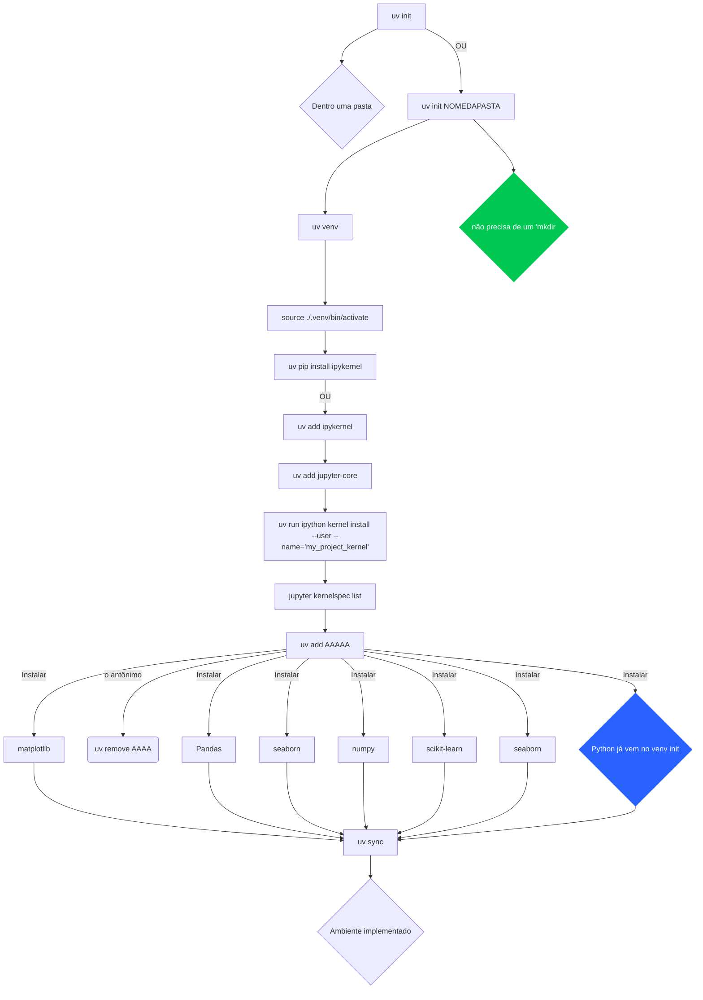
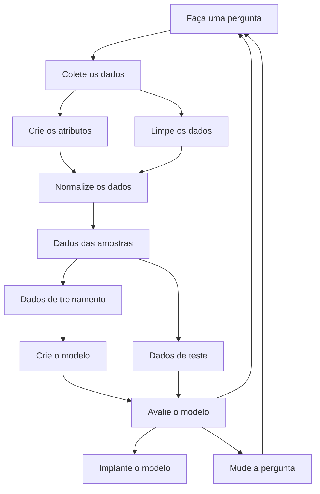

# Titanic Survival Prediction 🚢
Este projeto utiliza técnicas de Machine Learning para prever a probabilidade de sobrevivência dos passageiros do Titanic. O objetivo principal é responder à pergunta: "Quais tipos de pessoas tinham maior probabilidade de sobreviver?" utilizando dados históricos como idade, sexo, classe social,

## Tecnologias e Bibliotecas
O projeto foi desenvolvido em Python, utilizando as seguintes bibliotecas:

- Manipulação de Dados: pandas, os
- Visualização: matplotlib, yellowbrick
- Machine Learning: scikit-learn, xgboost
- Métricas e Avaliação: Matriz de Confusão, Curva ROC (AUC), Learning Curves e Validação Cruzada (StratifiedKFold).


## Modelos Testados
Para encontrar o melhor desempenho, o projeto explora diversos algoritmos de classificação:
- Regressão Logística (LogisticRegression)
- Árvores de Decisão (DecisionTreeClassifier)
- Random Forest (RandomForestClassifier)
- K-Nearest Neighbors (KNeighborsClassifier)
- Support Vector Machine (SVC)
- Naive Bayes (GaussianNB)
- XGBoost (XGBClassifier)

## Avaliação de Desempenho
O projeto utiliza a biblioteca Yellowbrick para visualizações avançadas de diagnóstico de modelo, incluindo:
- Confusion Matrix: Para visualizar erros de falso positivo e falso negativo.
- ROC/AUC Curve: Para medir a capacidade de separação das classes do modelo.
- Learning Curve: Para detectar problemas de overfitting ou underfitting.

## Fluxograma: Preparação do Ambiente


## A ideia bruta do nosso projeto
 ```mermaid
 flowchart TD
    A[Início] --> R(Estudar o problema)
    R --> |Criar projeto| B(Estruturar pastas)
    B --> |Download| G(Data)
    G --> H[Raw]
    H -->|Cortar| W[30% Dados de Validação]
    H -->|Cortar| Z[70% Dados de Treinamento]
    Z --> I[processed]
    G --> J[Post-prosseced]
    I --> |tratamento tipo:| M[Valores nulos]
    I --> |tratamento tipo:| S[Limpeza]
    I --> |tratamento tipo:| T[Missing data]
    I --> |tratamento tipo:| U[normalização]
    I --> |tratamento tipo:| V[codificando variáveis categôricas]
```
## A ideia do nosso machine learning


## Resultados

